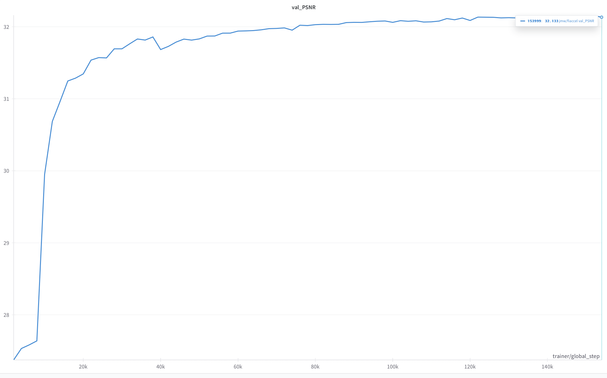

# FIACCEL in PyTorch

## Introduction
This is a PyTorch implementation of the FIACCEL

<p align='center'>
    
</p>

## Running the code
To facilitate training we use `pytorch_lightning` and `hydra` to manage model configurations.

To create an environment with all the requirements for running this code, we suggest first verifying that the PyTorch version in the `fiaccel.yml` file is appropriate for your OS and server and selecting an appropriate one if it is not.
Then create a new `conda` environment by running:
```
conda env create -f fiaccel.yml
conda activate fiaccel
```
You can train a model with `model_train.py` but remember to modify the the training configuration (`config/train_config_*.yaml`) and include paths to an appropriate training dataset.


### Training data

fiaccel is trained on a proprietary dataset with one million internet video clips, each comprising 3 frames.

- We use the publcicly available Vimeo-90k dataset ([Xue et al., 2019](https://arxiv.org/abs/1711.09078)), which is commonly used dataset for video frame interpolation

## FIACCEL: Implementation details

## TOP
<p align='center'>
    
</p>

## Core
<p align='center'>
    
</p>

## Experimental_settings
<p align="center">
  >
</p>

## video_screenshot
<p align="center">
  >
</p>